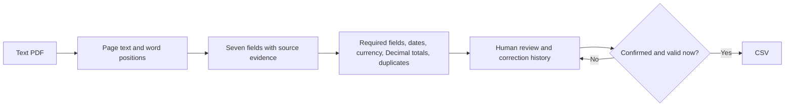

# PDF Invoice Reviewer

[简体中文](README.zh-CN.md) · [Evaluation & failure cases](docs/evaluation.md) · [Sample PDFs](fixtures)

Repository: [myp81607-dot/pdf-invoice-reviewer](https://github.com/myp81607-dot/pdf-invoice-reviewer). The local app is called Invoice Review Desk.

**For a small operations team that needs supplier PDFs in a spreadsheet without silently copying bad numbers.** Upload a text-based invoice, compare the extracted fields with the original page, resolve missing values or mismatches, and confirm it. Download a CSV containing only invoices that are both confirmed and currently valid.

Personal portfolio demonstration using synthetic invoices. No client data, payment processing, external AI calls, or accounting integrations.


## Try it in five minutes

Requires Git and Python 3.11+; verified on Python 3.12.14 / Windows:

```bash
git clone https://github.com/myp81607-dot/pdf-invoice-reviewer.git
cd pdf-invoice-reviewer
python -m venv .venv
# Windows PowerShell:
.venv\Scripts\Activate.ps1
# macOS / Linux instead: source .venv/bin/activate
python -m pip install -r requirements.txt
python -m uvicorn app.main:create_app --factory --host 127.0.0.1 --port 8766
```

Open [http://127.0.0.1:8766](http://127.0.0.1:8766). No API keys are needed. Example PDFs are already included; do not regenerate them to get started.

1. Upload `fixtures/development/01-normal.pdf`. Check the seven fields against the page. Enter a review note, then **Confirm invoice** and **Export confirmed CSV**.
2. Upload `07-amount-mismatch.pdf`. Its `638.25 + 63.82 = 702.07`, while the PDF says `707.07`. Confirmation is blocked with a `+5.00` difference. Reject the document or obtain a verified correction; do not change values just to make arithmetic pass.
3. Upload `08-missing-tax.pdf`. Tax stays empty. Confirmation is blocked rather than guessing it from the other numbers.
4. Upload `09-cross-page.pdf`; click the total's **p.2** evidence link. Re-upload the same file to see duplicate blocking. Reject the extra copy to clear the conflict.


## What the app checks



- **Evidence:** supplier, invoice number, date, currency, subtotal, tax and total each link to their source page and text fragment. Original extraction evidence remains visible after edits.
- **Deterministic arithmetic:** `Decimal(subtotal) + Decimal(tax) == Decimal(total)`. No floating-point tolerance or model-generated math. Conflicting printed values remain unresolved.
- **Two duplicate checks:** identical PDF bytes, and normalized supplier + invoice number. Invoice numbers from different suppliers may coexist. A new duplicate blocks even an already-confirmed record at export time.
- **Human control:** save, confirm or reject with a required note. Changes record before/after values and UTC time. Saving returns the record to pending. Rejection excludes it from export.
- **Real persistence:** SQLite stores the PDFs, extracted pages, current fields and review history. Restarting the app retains the review queue. `data/` is ignored by Git. Set `INVOICE_DB` to choose a different database; stop the app and use a new database path for a clean workspace.
- **CSV protection:** only valid confirmed rows are exported; strings that look like spreadsheet formulas are prefixed with an apostrophe. Export is a repeatable download, not a ledger posting operation.

## Verified results, including failures

Run `python -m pytest -q` and `python scripts/evaluate.py`.

**12 behavior tests passed**, including changed-input output, confirmation gating, duplicate lifecycle, cross-page evidence, correction history, restart persistence, scan rejection and a missing-field/neighbor-label regression. Two upstream test-client deprecation warnings were emitted.

| Evaluation stage | Present fields correct | Missing values kept null | Whole documents with all seven slots correct |
|---|---:|---:|---:|
| Development, initial supported layouts (19 text PDFs) | 131/131 | 2/2 | 19/19 |
| First independent layout, before geometry repair (10 PDFs) | 0/66 | 4/4 | 0/10 |
| Fresh independent layout, first pass (6 PDFs) | 35/41 (85.4%) | 1/1 | 0/6 |
| Current regression run after observed fixes (35 text PDFs) | 238/238 | 7/7 | 35/35 |

The initial failures matter: line-only parsing lost two-column blocks; a later supplier section title produced an ambiguous supplier. Both have targeted fixes. **The post-fix row is regression performance, not unseen accuracy.** All 36 PDFs require human review; one image-only scan is tested separately and blocked. The final rules pass checks on 22 valid text documents and block 13 defective ones. These are small synthetic sets, not a real-world accuracy estimate. See [raw results and exact denominators](docs/evaluation.md).

## Supported input contract and limits

English text PDFs with explicit labels: inline label/value, separated label/value rows, or aligned label-above-value blocks, including fields across pages. The app uses word coordinates; it does not understand arbitrary document semantics. Inline supplier fields require a colon. Standalone supplier labels above values may omit it.

| Field | Accepted labels |
|---|---|
| Supplier | Supplier, Vendor, Seller |
| Invoice number | Invoice number, Invoice reference/ref, Invoice no., Invoice ID, Invoice # |
| Date | Invoice date, Date issued, Issued on |
| Currency | Currency |
| Subtotal | Subtotal, Net amount |
| Tax | Tax, VAT amount |
| Total | Total, Total payable, Grand total, Amount due |

Labels are case insensitive. Dates: `YYYY-MM-DD` or explicit English `DD Month YYYY` / `DD Mon YYYY`; ambiguous numeric dates are blocked. Currency: USD, EUR, GBP or CNY, with no conversion. Amounts: nonnegative dot decimals, at most two fractional digits, optional grouped commas. Only the printed subtotal/tax/total relationship is checked; no line-item reconciliation, tax-rate validation or credit-note handling.

Up to 10 MB and 12 pages per file. Scans, mixed image/text pages without extractable text, encryption, handwriting, arbitrary supplier logos, unlabeled fields and multilingual/complex layouts are unsupported. A PDF with a poor text layer can still extract incorrectly: check the source. Missing text fields may be manually entered with a note; unsupported documents stay blocked. Supplier-name normalization only handles case and whitespace; aliases require human review.

Local single-reviewer app, without authentication or production upload isolation. Bind to loopback as shown; public deployment, multi-user approvals, ERP connections and retention policies are outside this demo. Audit notes are local records, not signed compliance evidence. No continuous demo video was recorded; screenshots come from the real running app.

## Implementation and references

FastAPI + SQLite backend; plain HTML/CSS/JavaScript UI; pdfplumber extraction and page rendering; ReportLab synthetic fixtures. Main files: [`app/extraction.py`](app/extraction.py), [`app/main.py`](app/main.py), [`tests/test_workflow.py`](tests/test_workflow.py).

This project implements its own field/evidence model, geometry rules, validation gates, review lifecycle, duplicate checks, UI and evaluation. AI assisted implementation and review; separate agents authored the independent layouts without reading the parser. It is not a fork of a larger invoice product.

- [invoice2data documentation and source](https://github.com/invoice-x/invoice2data), especially [`InvoiceTemplate`](https://github.com/invoice-x/invoice2data/blob/master/src/invoice2data/extract/invoice_template.py): informed the explicit label/template approach. No invoice2data runtime or supplier-template corpus is bundled.
- [pdfplumber documentation](https://github.com/jsvine/pdfplumber) and [`Page` source](https://github.com/jsvine/pdfplumber/blob/stable/pdfplumber/page.py): used `extract_text`, `extract_words`, page numbers and `to_image` for traceable extraction and review.

Both references use MIT licenses; their notices are retained in [`docs/licenses`](docs/licenses). References reviewed on 2026-09-19. This repository's original code and synthetic fixtures are [MIT licensed](LICENSE).

**Portfolio summary:** A local invoice-to-CSV review tool with source evidence, deterministic checks, duplicate blocking and auditable human corrections. Suitable as a starting point for a bounded, supplier-specific document workflow.
