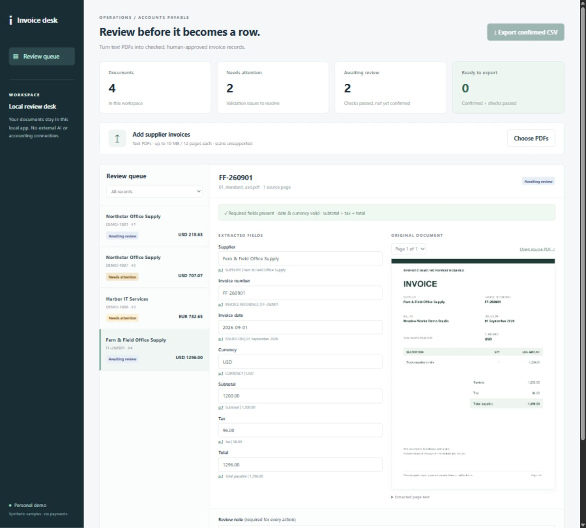
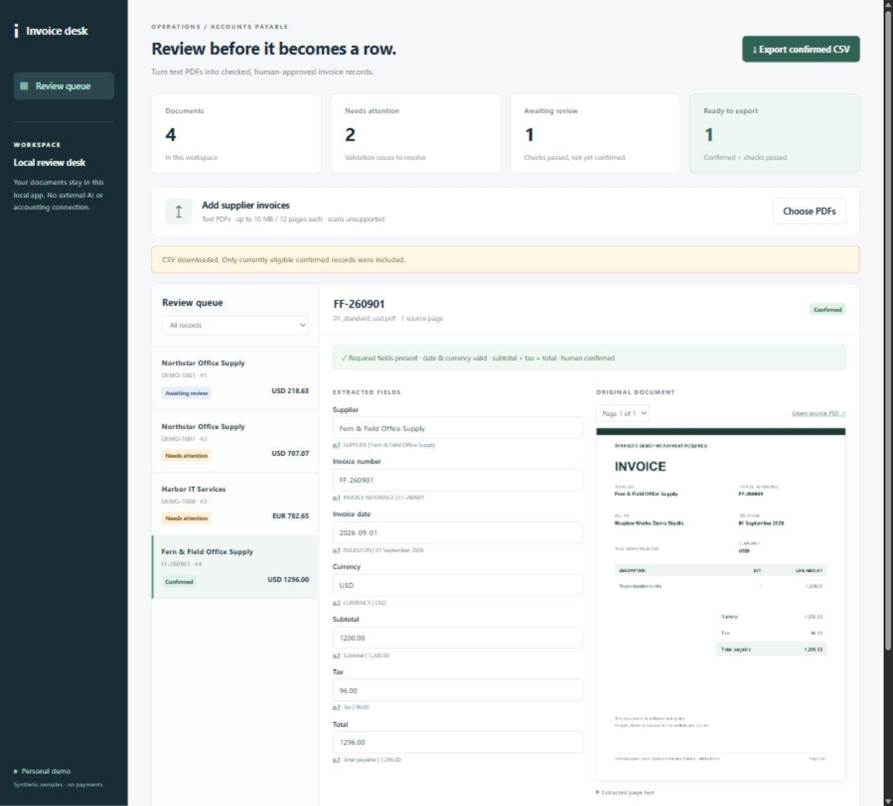
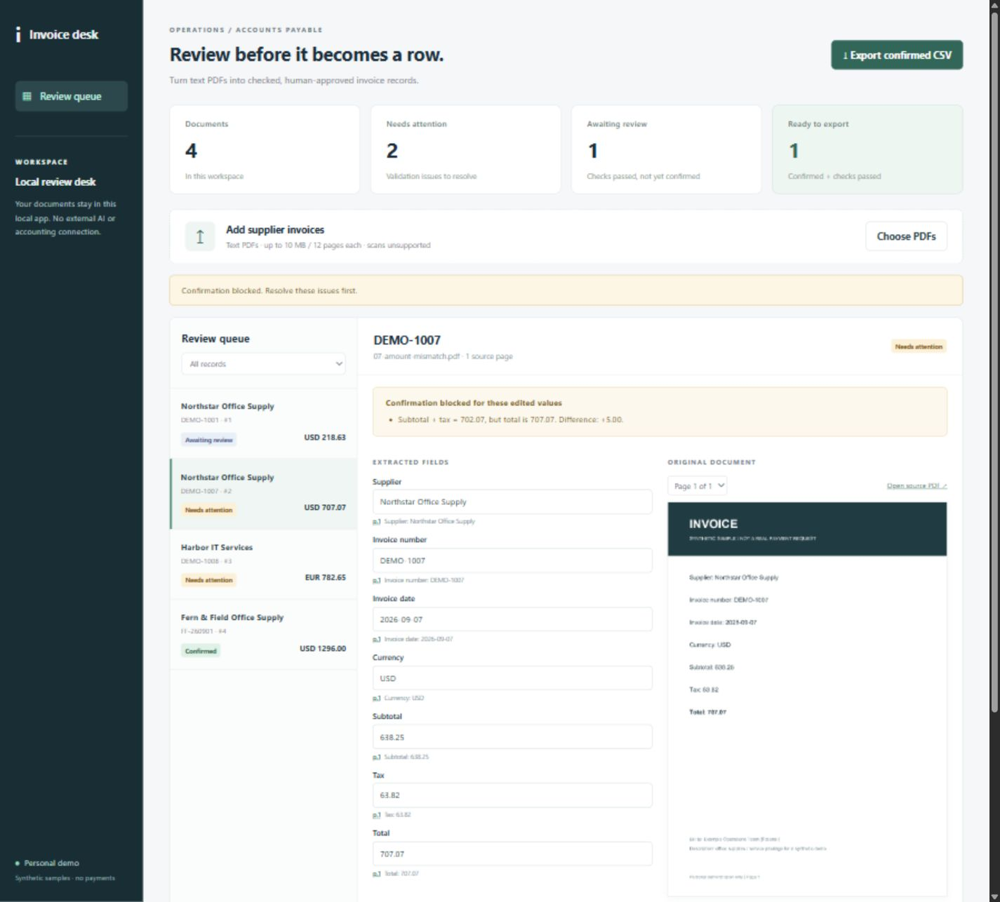
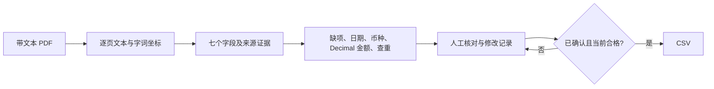

# Invoice Review Desk · 发票核对工作台

[English](README.md) · [评测与失败案例](docs/evaluation.md) · [合成 PDF](fixtures)

**为需要把供应商 PDF 整理成表格的小型运营团队而做。** 上传带文本的发票，将提取字段与原始页面并排核对，处理缺项或金额不符，再由人确认。下载的 CSV 只包含“已确认且当前校验仍通过”的记录。

这是使用合成发票的个人作品演示，没有客户数据，不付款，不调用外部 AI，不连接财务系统。



## 五分钟启动

需要 Python 3.11+；实测环境为 Windows、Python 3.12.14。在仓库目录执行：

```bash
python -m venv .venv
# Windows PowerShell：
.venv\Scripts\Activate.ps1
# macOS / Linux 改为：source .venv/bin/activate
python -m pip install -r requirements.txt
python -m uvicorn app.main:create_app --factory --host 127.0.0.1 --port 8766
```

打开 [http://127.0.0.1:8766](http://127.0.0.1:8766)。无需 API key；仓库已经附带 PDF，无需先运行生成器。

1. 上传 `fixtures/development/01-normal.pdf`。对照原文核对七个字段，填写审核说明，点击 **Confirm invoice**，再点击 **Export confirmed CSV**。
2. 上传 `07-amount-mismatch.pdf`。税前金额与税额为 `638.25 + 63.82 = 702.07`，原文总额却是 `707.07`，系统显示差额 `+5.00` 并阻止确认。应拒绝或取得经核实的更正，不能仅为通过计算而修改数字。
3. 上传 `08-missing-tax.pdf`。缺失税额保持为空，不会用另两个金额自动补算。
4. 上传 `09-cross-page.pdf`，点击总额的 **p.2** 查看第二页证据；再次上传同一 PDF 会触发重复文件拦截，拒绝额外副本后可解除冲突。




## 它具体做什么



- **看得到依据：** 供应商、单据号、日期、币种、税前金额、税额、总额均关联来源页码和文本片段。人工改值后仍保留原始提取依据。
- **确定性核算：** 用 Decimal 严格验证“税前金额 + 税额 = 总额”，不交给模型算钱，不使用浮点近似。同一字段出现矛盾值时要求人工处理。
- **两种查重：** 文件内容完全相同，以及“规范化供应商名 + 单据号”相同。不同供应商可使用相同单据号；新出现的重复记录也会使旧的已确认记录暂时不能导出。
- **人工负责最终确认：** 保存、确认、拒绝都需要说明，记录改前/改后值和 UTC 时间。保存修改后回到待确认；拒绝记录不能导出。
- **真实持久化：** SQLite 保存 PDF、文本、当前字段和审核历史，重启仍保留。`data/` 不进入 Git。可用 `INVOICE_DB` 指定数据库；需要全新工作区时先停止应用，再使用新的数据库路径。
- **CSV 出口：** 只导出当前合格的已确认记录；疑似电子表格公式的字符串加单引号前缀。重复下载会得到当前快照，它不是财务过账接口。

## 实测结果，也公开失败

执行 `python -m pytest -q` 和 `python scripts/evaluate.py`。

**12 项行为测试通过**，覆盖输入变化影响输出、确认与导出限制、重复生命周期、跨页证据、修改历史、重启、扫描件拒绝、空字段误吞邻近标签的回归修复。测试依赖产生两条弃用警告，未影响通过。

| 阶段 | 已有字段精确正确 | 真缺失保持 null | 七个槽位全部正确的整单 |
|---|---:|---:|---:|
| 开发集，初始支持布局（19 份文本 PDF） | 131/131 | 2/2 | 19/19 |
| 首批独立布局，坐标修复前（10 份） | 0/66 | 4/4 | 0/10 |
| 新独立布局，首次评测（6 份） | 35/41（85.4%） | 1/1 | 0/6 |
| 修复观察到的问题后，当前回归（35 份文本 PDF） | 238/238 | 7/7 | 35/35 |

首次失败来自双栏上下标签布局被纯文本合并；第二次是供应商区域标题被当成另一个候选值。均已针对性修复。**修复后的数字只是回归结果，不能当作未见样本准确率。** 36 份 PDF 均须人工审核；其中 1 份图像扫描件单独统计并被拦截。最终规则使 22 份内容正常的文本单据通过校验，拦截 13 份有缺陷的文本单据。样本小且为合成资料，不代表真实业务整体准确率。完整分母、原始结果见 [评测说明](docs/evaluation.md)。

## 支持范围与边界

英文、带文本、明确标签的供应商发票；支持标签和值同行、分隔的左右字段、标签在上值在下、字段跨页。提取基于字词坐标，不能理解任意文档语义。同行供应商字段要求冒号；独立放在值上方的供应商标签可以省略冒号。

| 字段 | 识别标签（不区分大小写） |
|---|---|
| 供应商 | Supplier、Vendor、Seller |
| 单据号 | Invoice number、Invoice reference/ref、Invoice no.、Invoice ID、Invoice # |
| 日期 | Invoice date、Date issued、Issued on |
| 币种 | Currency |
| 税前金额 | Subtotal、Net amount |
| 税额 | Tax、VAT amount |
| 总额 | Total、Total payable、Grand total、Amount due |

日期接受 ISO `YYYY-MM-DD` 或明确英文月份的 `DD Month YYYY` / `DD Mon YYYY`；有歧义的数字日期不猜。币种仅 USD/EUR/GBP/CNY，不换汇。金额为非负、点作小数点、最多两位小数、可带规范千位逗号。只检查三个汇总金额，不校验行项目、税率，也不处理贷项通知单。

单文件最多 10 MB、12 页；不支持扫描、含无文本页面的混合 PDF、加密、手写、仅有 Logo 的供应商名、无标签字段、多语言或任意复杂布局。文本层有问题时仍可能提取错误，必须看原文。文本发票缺字段可人工填写并记录依据；不支持的文档仍保持拦截。供应商名称仅按大小写和空白归一化，别名由人核对。

这是本地单人审核应用，没有鉴权及生产上传隔离，按启动示例绑定回环地址。公网部署、多用户审批、ERP 接入及留存制度不在本作品范围内；本地修改记录不是签名合规证据。未录制连续演示视频，截图全部来自实际运行。

## 实现与参考

FastAPI + SQLite 后端，原生 HTML/CSS/JavaScript 界面，pdfplumber 提取和页面渲染，ReportLab 生成合成资料。核心代码：[`app/extraction.py`](app/extraction.py)、[`app/main.py`](app/main.py)、[`tests/test_workflow.py`](tests/test_workflow.py)。

本项目自行实现字段与证据结构、坐标匹配、校验门槛、审核状态、查重、UI 与评测。使用 AI 辅助编码和审查，独立代理在不读取解析器的情况下生成验证布局；没有复制大型项目后冒充自行开发。

- [invoice2data 文档与源码](https://github.com/invoice-x/invoice2data)，尤其 [`InvoiceTemplate`](https://github.com/invoice-x/invoice2data/blob/master/src/invoice2data/extract/invoice_template.py)：借鉴明确标签/模板的思路；没有打包该项目的运行时或供应商模板库。
- [pdfplumber 文档](https://github.com/jsvine/pdfplumber) 与 [`Page` 源码](https://github.com/jsvine/pdfplumber/blob/stable/pdfplumber/page.py)：实际使用逐页文本、字词坐标、页码和 `to_image`，将提取值关联到可核对的原始页面。

两者均为 MIT 许可，来源许可保存在 [`docs/licenses`](docs/licenses)。查阅日期为 2026-09-19。本仓库代码及合成资料采用 [MIT 许可](LICENSE)。

**作品一句话：** 将供应商发票转为带来源依据的审核表，通过金额核算、重复拦截和人工修改记录，让合格的已确认条目才能导出 CSV；适合作为明确供应商范围的文档处理项目起点。
